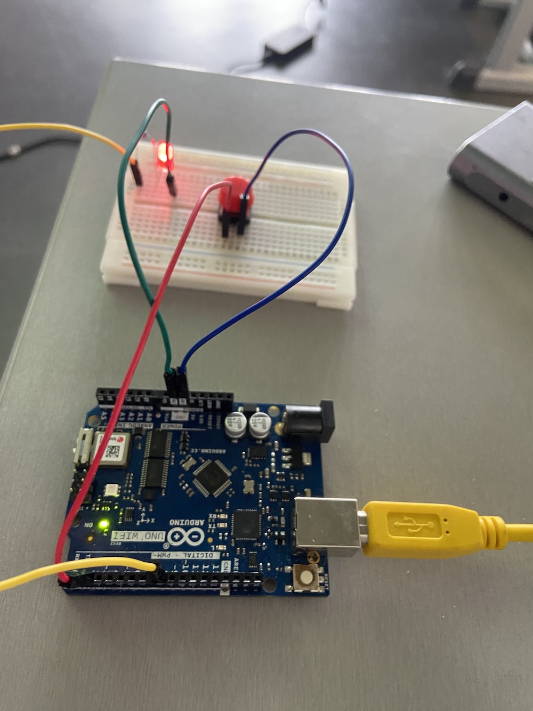
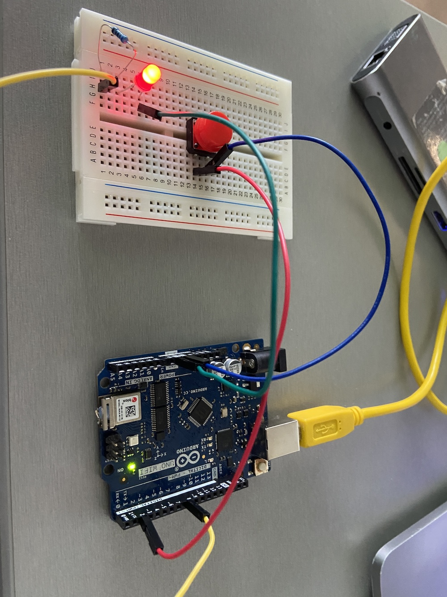

# MQTT voorbeeld met Arduino (WiFiNINA)
Dit project toont hoe je een Arduino-compatibel board met WiFiNINA (bijv. MKR WiFi 1010, Nano 33 IoT) verbindt met een Wi-Fi netwerk en een MQTT-broker.
De repository bevat een eenvoudige sketch `arduino-mqtt-pubsub.ino` en een `secrets.h.example` waarin je netwerk- en MQTT-gegevens kunt invullen. Kopieer `secrets.h.example` naar `secrets.h` en vul je eigen gegevens in voordat je de sketch uploadt.

## Voorbeeld
Hieronder zie je twee voorbeelden van de setup:





## Inhoud
- `arduino-mqtt-pubsub.ino`  - Arduino sketch die verbinding maakt met Wi-Fi en een MQTT-broker.
- `secrets.h.example`    - Voorbeeldbestand met placeholders voor SSID, wachtwoord en MQTT-gegevens.
- `secrets.h`            - (Niet in repo: moet je zelf aanmaken) Kopieer van `secrets.h.example` en vul jouw geheimen in.

## Benodigdheden
- Een Arduino-bord met WiFiNINA ondersteuning (bijv. MKR WiFi 1010, Nano 33 IoT).
- Arduino IDE (of PlatformIO) met de volgende libraries geïnstalleerd:
	- WiFiNINA
	- PubSubClient (of de in de sketch gebruikte MQTT-library)
- Toegang tot een Wi-Fi netwerk (SSID + wachtwoord).
- Een MQTT-broker (bijv. public broker zoals test.mosquitto.org, of een lokale broker zoals Mosquitto).

## Configuratie
1. Maak een kopie van `secrets.h.example` en noem deze `secrets.h`:
	```bash
	cp secrets.h.example secrets.h
	```
2. Open `secrets.h` en vul je gegevens in:
	- WIFI_SSID: je netwerknaam
	- WIFI_PASSWORD: je Wi-Fi wachtwoord
	- MQTT_SERVER: het adres van je MQTT-broker
	- MQTT_PORT: poort (meestal 1883)
	- MQTT_USER / MQTT_PASSWORD: (optioneel) inloggegevens voor de broker
3. Sla `secrets.h` op. Zorg dat `secrets.h` NIET in versiebeheer komt (deze repo bevat al `secrets.h` in .gitignore doorgaans).

## Uploaden naar je board
1. Open `arduino-mqtt-pubsub.ino` in de Arduino IDE.
2. Selecteer je board en poort (Tools > Board en Tools > Port).
3. Installeer de benodigde libraries via Library Manager als dat nog niet is gebeurd.
4. Klik op Upload.

## Verwachte werking
Bij succesvol uploaden zal het board verbinding maken met je Wi-Fi netwerk en proberen contact te maken met de opgegeven MQTT-broker. De sketch kan (afhankelijk van implementatie) berichten publiceren op een topic of abonnementen openen.
Open de seriële monitor (baud rate zoals in de sketch, meestal 9600) om statusmeldingen te zien (verbonden met Wi-Fi, MQTT verbonden, foutmeldingen).

## Troubleshooting
- Geen verbinding met Wi-Fi:
	- Controleer SSID en wachtwoord in `secrets.h`.
	- Controleer of het board WiFiNINA ondersteunt en de firmware van het WiFi-module up-to-date is.
	- Plaats het board dichter bij de router.

- MQTT verbinding mislukt:
	- Controleer dat de broker bereikbaar is (ping of telnet naar poort 1883).
	- Controleer serveradres en poort in `secrets.h`.
	- Controleer of je broker authenticatie of TLS vereist; pas de sketch aan indien nodig.

- Fout: WiFiNINA firmware mismatch:
	- Gebruik de WiFiNINA firmware updater (beschikbaar via de Arduino IDE of als voorbeeld in de WiFiNINA library) om de firmware te updaten.

## Security
- Zet nooit gevoelige gegevens zoals Wi‑Fi wachtwoorden of broker-wachtwoorden in publieke repositories. Gebruik `secrets.h` en voeg deze toe aan `.gitignore`.

## Aanpassen
Pas `arduino-mqtt-pubsub.ino` aan om andere MQTT-topics te gebruiken, extra sensoren toe te voegen of TLS/authenticatie te ondersteunen.
